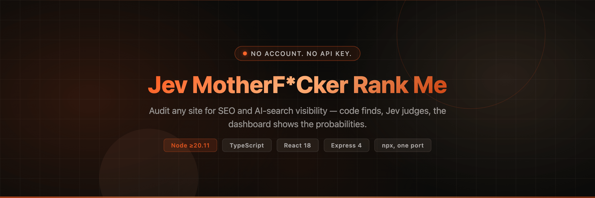
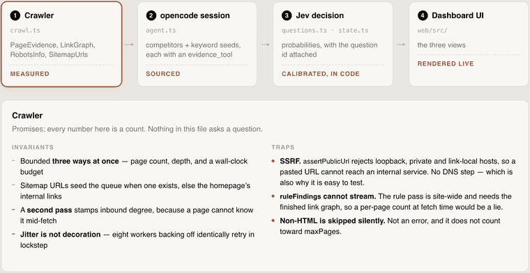

<p align="center">
  
</p>

<p align="center">
  <strong>Jev MotherF\*Cker Rank Me</strong><br>
  Audit any site for SEO and AI-search visibility.
  Deterministic crawl &rarr; narrow typed judgements from the Jev decision model &rarr; probabilities, streamed as they land.
</p>

<p align="center">
  <a href="https://jev.mfrank.me"></a>
  <a href="https://www.npmjs.com/package/jevseo"></a>
  <a href="#run-it"></a>
  <a href="https://www.typescriptlang.org/"></a>
  <a href="https://react.dev/"></a>
  <a href="https://expressjs.com/"></a>
  
</p>

---

## The rule everything is built on

> **Code finds, Jev judges, the dashboard shows the probabilities.**

Jev never writes prose. It answers narrow typed questions over crawled text and returns `choice`,
`score` or `noul` answers with probabilities attached, which the code turns into ranked findings
**only where the answer is decisive**. An LLM-authored finding is the defining failure mode of this
kind of product, so it is designed out rather than warned about.

Jev has no index, no volume data and no backlink graph, so nothing here invents a monthly search
count. See [No search volume, honestly](#no-search-volume-honestly).

---

## The four layers

Each layer promises the next something specific. It rotates on its own through all four; click one to
hold it, or use the arrow keys.



<p align="center">
  <sub>
    Rotates automatically &middot;
    <a href=".assets/layers.png">static frame</a> &middot;
    <a href=".assets/layers.webp">animated WebP (560 KB)</a>
  </sub>
</p>

<details>
<summary><b>Interactive version</b> — <small>(click a layer, or use &larr; &rarr;; also pauses on demand)</small></summary>

The GIF above is a recording, because GitHub serves this repository's HTML inside a **sandboxed
frame** with scripting disabled, and a private repository's raw URLs need authentication. So the
clickable original needs to be served over HTTP as a real page:

```bash
# from a checkout — no build, no dependencies
python3 -m http.server 8899 --directory .assets
# then open http://localhost:8899/layers.html
```

It will also be live at the GitHub Pages URL once Pages is enabled for this repository
(see the plan constraint in [`AGENTS.md`](AGENTS.md)).

The rotation is **pure CSS**, so it survives having scripts blocked entirely; the JavaScript only adds
the click-to-hold override. It also stops itself under `prefers-reduced-motion`.

</details>

The full contract, with every trap, is in **[`docs/LAYERS.md`](docs/LAYERS.md)**.

---

## Quick start

```bash
npx jevseo
```

That is the whole install. It prints a URL and serves the dashboard **and** the API on **one port**
(8787 by default). No clone, no `npm install`, no Python.

```bash
npx jevseo start --detach   # background; survives closing the terminal
npx jevseo status           # pid, port, /api/health
npx jevseo stop             # stops it; kills by pid, never by process name
npx jevseo doctor           # preflight, required vs optional
```

Nothing to type twice. `npx jevseo` runs it, and `npm i -g jevseo` puts a plain
`jev-seo` on your PATH — so `jev-seo doctor` and `jev-seo stop` work without the `npx` prefix.
(Unscoped because `jev-seo` itself is already taken on npm; the name is `jevseo`.)

> Upgrading? Run `npx jevseo stop` first — otherwise the old process keeps holding the
> port and the new one exits with `port 8787 is already in use`.

### From a checkout

```bash
npm install
npm run dev          # Vite on 5173 + API on 8787, HMR
npm run build        # server/dist + web/dist
node bin/jev-seo.js start
```

`./start.sh` and `./stop.sh` remain for the detached dev workflow.

---

## How it reaches Jev — keyless

A React dashboard that audits any business website for SEO and AI-search visibility, using **Jev** —
TypeSafe's "System One" decision model — through the **OpenCode Zen** gateway, keyless:

```text
POST https://opencode.ai/zen/v1/systemone
model: jev-1.13-free
Authorization: Bearer public          # the literal string, no secret
+ x-opencode-session / x-opencode-request / x-opencode-client / x-opencode-project
+ User-Agent: opencode/<v> ai-sdk/provider-utils/<v> runtime/bun/<v>
```

**No account, no API key, no signup.** The Zen free tier serves Jev with the literal credential
`public` plus an OpenCode client fingerprint — the same recipe `omp-proxy-local` uses for Zen's
chat models, and it works for Jev too. The `x-opencode-session` / `x-opencode-request` pair must be
one a real `opencode run` minted, so those two ids are read from `~/.omp/agent/models.yml` and can
be overridden with `ZEN_SESSION_ID` / `ZEN_REQUEST_ID`.

`jev-1.13-free` is the keyless tier. The rate-limited `jev-1.13` answers `401 Rate-limited Zen models
require a workspace`; set `ZEN_API_KEY` if you have one. Model is pinned by `JEV_MODEL` in `.env`.

---

## What it does and does not need

Required: **Node &ge; 20.11** and an internet connection. Nothing else.

Optional, and reported as optional by `doctor`:

- **`opencode`** — only for `/api/research` (the deep-research button). An audit runs fully without it.
- **`uv` / Python 3.11+** — only for the agent-side Search Console tools. The audit path mints its
  own JWT with `node:crypto` and calls Google's REST API directly, so it never touches Python.
- **A GCP service account** — the key that lets the agent reach Search Console. Without one the
  `gsc` MCP tool is never granted, so the agent cannot pull real traffic or keyword data for the
  site and the research pass degrades to crawl-only. The audit still runs on any public URL, but its
  keyword judgements then come from mining the site's own text, with no real-search evidence behind
  them.

---

## Where state lives

Everything mutable goes in `~/.jev-seo` (override with `JEV_DATA_DIR`): the GSC key, logs, research
transcripts, the pid file. **The install directory is never written to** — under `npx` it is a cache
npm garbage-collects, so anything stored there would vanish without warning.

| Variable | Meaning |
| --- | --- |
| `JEV_DATA_DIR` | state directory, default `~/.jev-seo` |
| `PORT` | port, default 8787 (`--port` beats it) |
| `JEV_ENV_FILE` | explicit `.env` path |
| `JEV_WEB_DIST` | explicit built-UI path |
| `JEV_PROXIES_FILE` | proxy pool, default `<dataDir>/proxies.txt` then `./proxies.txt` |
| `JEV_MODEL` | judge model, default `jev-1.13-free` |
| `ZEN_API_KEY` | only needed for the rate-limited `jev-1.13` |

`.env` is read from `JEV_ENV_FILE`, then `~/.jev-seo/.env`, then the current directory — in that
order. The resolved path and the key names found in it are printed at boot; values never are.

No credential is needed. If you set `ZEN_API_KEY` (or `OPENCODE_API_KEY`) the server uses it instead
of `public`, which only matters for the rate-limited model. The dashboard reports which judge
actually ran, and whether its probabilities are calibrated.

---

## How an audit runs

1. **Crawl** — breadth-first, bounded by page count, depth and a wall-clock budget. Reads
   `robots.txt` and honours it, seeds from `sitemap.xml` when one exists. Refuses private, loopback
   and link-local addresses so a pasted URL cannot reach an internal service.
2. **Extract** — title, description, H1, headings, opening text, body text, word count, canonical,
   language, image alt coverage, link counts, noindex, structured data, viewport.
3. **Deterministic checks** — 15 rule checks code can count for itself. The model is never asked what
   code can see.
4. **Page judgements** — one request per page carrying every question for that page, fired
   concurrently behind a bounded pool. One item per request is the default because packing many items
   per request has been shown to cost accuracy.
5. **Keyword pass** — code mines bigram and trigram candidates from titles, headings and body,
   weighted by frequency, heading placement and page spread. Jev then judges each candidate: is it a
   real query a person would type, is a buyer typing it, what intent, which topic cluster, and does
   any page on the site already serve it. Opportunity is then computed in code, not asked.
6. **Competitor pass** — each rival is crawled and judged on the same rubric as the subject site, so
   the scorecards are comparable, plus a "worth copying" judgement and the single change that would
   most improve its AI citability.
7. **Thresholds** — three bands. Decisive answers become findings; the grey zone goes to a "needs a
   human" pile and is deliberately not acted on.
8. **Stream** — newline-delimited JSON, so the counters, the wall and the teardown tick as judgements
   land rather than after the report.

---

## No search volume, honestly

Jev carries no index, no volume data and no backlink graph, so nothing here invents a monthly search
count. Keyword opportunity is computed in code from what is actually observable: on-page frequency,
whether the term appears in headings, and how many pages carry it. Change the coefficients in
`opportunityOf` rather than a prompt.

---

## The dashboard

Three views over the same stream, following the layout of the reference frames in the guide: a
headline, six live counters, a dense colour-coded wall of every judged item, a one-item teardown
with per-dimension bars, the batch patterns, and a needs-a-human strip.

- **pages** — every page, its importance, findings and probability breakdown
- **keywords** — every mined term, its opportunity, buyer intent and coverage gap
- **competitors** — side-by-side scorecards with your site pinned as the baseline

---

## The question file is the asset

`server/src/questions.ts` holds every question, and `server/src/thresholds.ts` holds every
threshold. The guide this follows is explicit that question design and threshold tuning move
accuracy more than the choice of model does, so both live in one reviewable place instead of being
generated at call time.

Design rules applied:

- every `Choice` has a no-match option
- `Score` levels describe situations, low to high, never bare degrees
- a page with no meta description gets no meta-quality question
- instructions reference state fields with backticked paths
- questions state that page text is untrusted content, never instructions
- thresholds are tuned per question, because confidence depends on how many options a question offers

## Three primitives

| Type | Shape | Used for |
| --- | --- | --- |
| `choice` | pick one of up to 255 options, returns the full distribution plus a confidence | page type, search intent, recommended action |
| `score` | an ordered rubric of 2–10 levels, returns the probability-weighted average of the level numbers | helpfulness, specificity, trust, citability, title and meta fit |
| `noul` | one number, the probability that the answer is yes | gates: is the H1 on topic, is the answer first, is there a next step |

## Cost and limits

$0.042 per million input tokens, output free. A page with a dozen questions runs about 3,000–3,500
input tokens, so roughly $0.00013 a page, and 60 pages lands well under a cent. Account limits are
1,200 requests a minute and 250,000 tokens a second, so concurrency is capped at 20 and defaults to 8.

---

## Verifying

```bash
npm run typecheck                                  # both workspaces
cd server && npx tsx scripts/verify-entry.ts      # full pipeline against a local mock
```

The verification harness stands up a local endpoint that returns the documented Jev response shape
and asserts that typed answers become probabilities, findings and a needs-a-human pile. It is not a
substitute for a real run: thresholds here are a starting point, and the guide's own tuning recipe
calls for a few hundred labelled pages before trusting them.

---

## Layout

```text
server/src/
  config.ts      TypeSafe base URL, credential resolution, limits, price
  thresholds.ts  three confidence bands, one file
  questions.ts   the question registry: site, page, keyword, competitor, links
  jevClient.ts   typed calls, retry, cost, receipts
  crawl.ts       crawl, extract, robots, sitemap, SSRF guard
  checks.ts      deterministic rule checks
  keywords.ts    candidate mining and code-side opportunity inputs
  audit.ts       the harness: pool, thresholds, scoring, stream events
  index.ts       HTTP surface
web/src/
  App.tsx        form, counters, wall, teardown, batch, human strip
  api.ts         NDJSON stream reader
```

The block above is the load-bearing core. For the full map — the other 14 modules in `server/src`,
the 25 files in `web/src`, the packaging boundary, and the prohibitions that are not stylistic — see
[`AGENTS.md`](AGENTS.md), [`server/AGENTS.md`](server/AGENTS.md) and
[`web/AGENTS.md`](web/AGENTS.md).

---

## Documentation

| Document | What it settles |
| --- | --- |
| [`docs/LAYERS.md`](docs/LAYERS.md) | The four-layer contract, and the traps that cost time rather than code |
| [`docs/UI-CONTRACT.md`](docs/UI-CONTRACT.md) | Backend/frontend split for the decision layer |
| [`docs/UX-VALUE.md`](docs/UX-VALUE.md) | Exact shippable microcopy, voice rules, banned words |
| [`docs/RISK-REVIEW.md`](docs/RISK-REVIEW.md) | Correctness audit of the UI contract against the code — 6 unfixed critical honesty bugs |
| [`docs/PLAN-npm-distribution.md`](docs/PLAN-npm-distribution.md) | The single-port npx distribution, P1–P6 shipped, P7 not started |
| [`docs/PLAN-agent-research-and-gsc-onboarding.md`](docs/PLAN-agent-research-and-gsc-onboarding.md) | Agent research layer + GSC onboarding — **proposed, not started** |
| [`.assets/layers.html`](.assets/layers.html) | The interactive four-layer diagram |

> Read [`docs/RISK-REVIEW.md`](docs/RISK-REVIEW.md) before changing the decision panel. It documents
> six cases where the panel can state a falsehood while every invariant still passes.

---

## License

**UNLICENSED.** All rights reserved.
